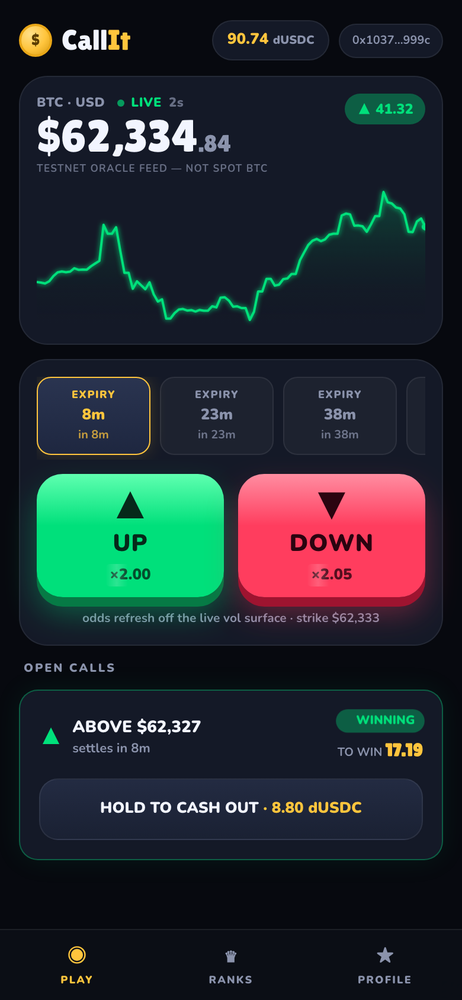
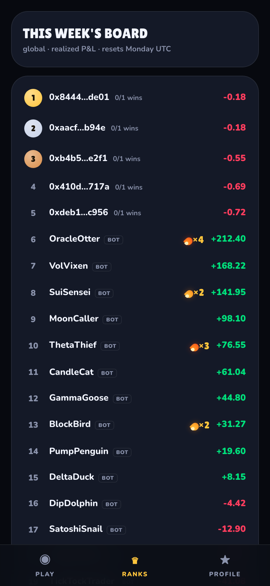
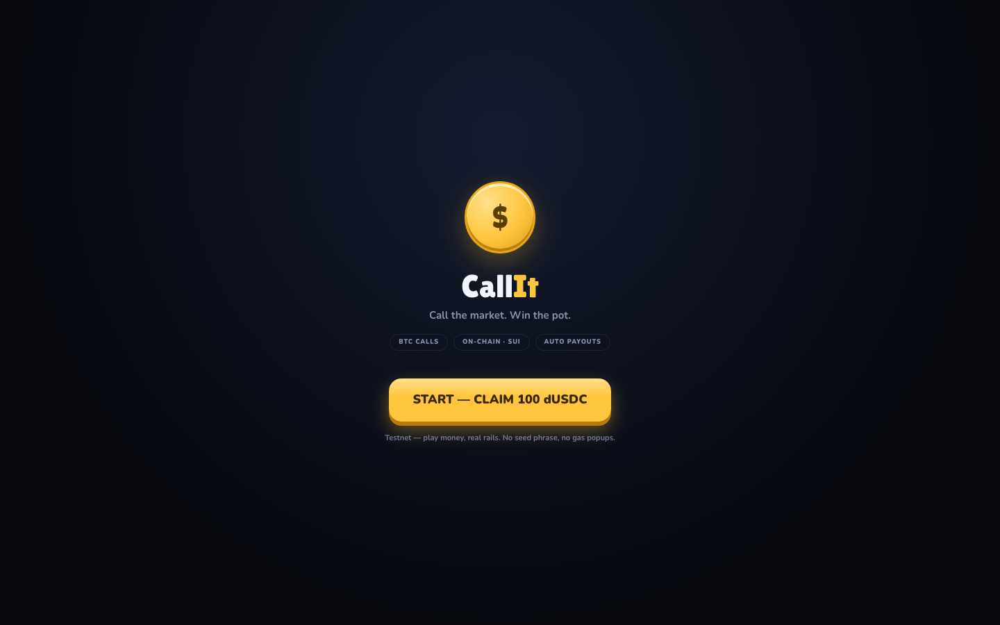
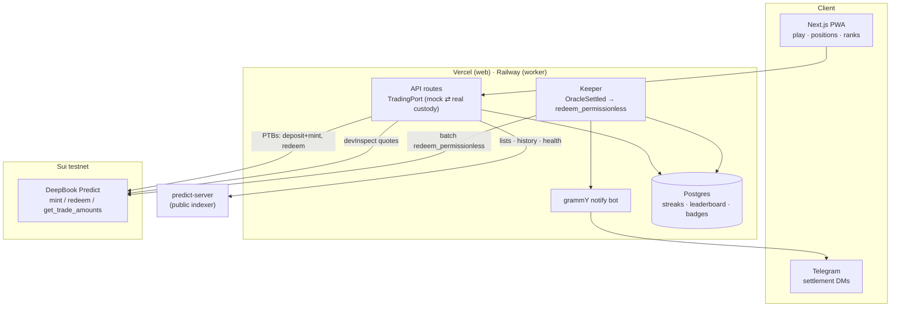

# CallIt — call the market, win the pot 🎯

**A gamified BTC prediction game built on [DeepBook Predict](https://github.com/MystenLabs/deepbookv3/tree/predict-testnet-4-16/packages/predict) · Sui Overflow 2026, DeepBook track**

Pick UP or DOWN on BTC, stake dUSDC, and get paid the moment the oracle settles — no wallet extension, no seed phrase, no gas popups. Every multiplier on screen is priced by the protocol's live SVI volatility surface, and a keeper claims winnings for you automatically.

🌐 **Play now: [callit-seven.vercel.app/play](https://callit-seven.vercel.app/play)** · [Landing](https://callit-seven.vercel.app) (→ callit.markets) · Sui testnet

<p align="center">
  
  
</p>
<p align="center">
  
</p>

## Don't trust it — click it

Every flow below is a real DeepBook Predict transaction on Sui testnet:

| Flow | Entry point | Proof |
|---|---|---|
| Account creation | `predict::create_manager` | [tx ↗](https://suiscan.xyz/testnet/tx/BGtfqMr69vS3wg2jMaS4cQ7DgMgnawRForTnEJkRCVtB) |
| $10 call minted | `predict::mint` (deposit + mint, one PTB) | [tx ↗](https://suiscan.xyz/testnet/tx/B2SyPtz14h41pBgKGbCZcQWxdDd1uNcMoUvwQ3DtN6sJ) |
| Early cash-out | `predict::redeem` at the live bid | [tx ↗](https://suiscan.xyz/testnet/tx/7VZ7CtAcpJTNupwQgDRfFnuPkQNR4LZdsyCfgSkVdk2o) |
| Keeper auto-claim | `predict::redeem_permissionless` (executor ≠ owner) | [tx ↗](https://suiscan.xyz/testnet/tx/35txXpaBp2kPKAQk7zP9s8h5DWGhKEmvFkLZEuCp1GMz) |
| Live trading account | `PredictManager` shared object | [object ↗](https://suiscan.xyz/testnet/object/0xfa7390c9eb0329e7abac5e043afc08398c05c5de9c736e3554350c8929442012) |

## What this is — and isn't

- **Testnet only, play money.** dUSDC is a gated test asset; nothing here is financial advice or a real-money product.
- **BTC only, for now.** The protocol's oracle set defines the markets; new underlyings appear automatically when activated.
- **The spread is real and shown.** Mint at ask, redeem at bid — the bet panel displays the round-trip spread before you lock in. The house edge is the protocol's pricing, not ours.
- **Mainnet depends on DeepBook Predict's mainnet timeline.** Our side is a config swap (see below); the protocol team owns the launch date.

## Why this exists

Prediction markets are powerful and almost universally unplayable for normal people: wallets, gas, order books, Greek-letter pricing. CallIt compresses DeepBook Predict's full institutional machinery — SVI-surface pricing, strike grids, on-chain settlement — into a one-thumb game loop: **call it, watch it, get paid.** Streaks, badges and a weekly leaderboard close the retention loop.

## Architecture



**Custody is on-chain; Postgres is only the social layer** (streaks/badges/leaderboard) and can be rebuilt by replaying `PositionMinted` / `PositionRedeemed` / `OracleSettled` events.

Three read paths, following the protocol team's integration model:

1. **predict-server REST** — lists, history, portfolio rendering (with a disk-cached fallback for the heavy oracle-list endpoint)
2. **Live feed freshness** — per-oracle price/SVI timestamps drive the in-UI health fuse and the LIVE ticker
3. **Direct on-chain reads** — devInspect on `get_trade_amounts` / `balance` / `position` for quotes and confirmation-critical state

### DeepBook Predict integration points

| Protocol surface | Where CallIt uses it |
|---|---|
| `predict::create_manager` | sponsored at signup — every user gets a real on-chain trading account |
| `predict_manager::deposit` + `predict::mint` | one PTB per bet (deposit tops up only the shortfall) |
| `predict::redeem` | hold-to-confirm cash-out at the live bid |
| `predict::redeem_permissionless` | keeper auto-claims every settled position — users do nothing |
| `predict::get_trade_amounts` | every multiplier/payout preview on screen (devInspect, no signature) |
| `market_key::new` | typed via `@mysten/codegen` bindings, piped inside the PTB |
| Oracle lifecycle + feed timestamps | dynamic expiry chips, staleness fuse, settlement detection |
| `PositionMinted` / `PositionRedeemed` events | tx receipts, social-layer records, settlement DMs |

Bindings are generated with `@mysten/codegen` **from the deployed on-chain package**, so they always match live bytecode. Two design decisions worth calling out:

- **Expiries are never hardcoded.** The active-oracle list drives the UI. When the protocol switched testnet from weekly to 15-minute rolling expiries mid-hackathon, CallIt's chips followed automatically with zero code changes.
- **The oracle health fuse is real.** If a feed goes stale (>25s, ahead of the protocol's 30s rejection threshold) betting is disabled with an explicit `ORACLE STALE` state — verified in production when the old weekly feeds were retired.

One protocol subtlety: `create_manager` shares the `PredictManager` inside Move, so a brand-new account can't deposit/mint in the same PTB. CallIt therefore creates the manager at signup (sponsored) and keeps every bet a single `deposit + mint` PTB.

### Testnet deployment targets

| | |
|---|---|
| Predict package | `0xf5ea2b3749c65d6e56507cc35388719aadb28f9cab873696a2f8687f5c785138` |
| Predict shared object | `0xc8736204d12f0a7277c86388a68bf8a194b0a14c5538ad13f22cbd8e2a38028a` |
| Quote asset | `0xe950…3e1a::dusdc::DUSDC` (testnet-only, 6 decimals) |
| Indexer | `https://predict-server.testnet.mystenlabs.com` |

## Repository layout

```
callit-app/
├── apps/web        # Next.js PWA (/play) + desktop HUD + landing (/)
├── apps/worker     # keeper (settlement watch → permissionless redeem) + Telegram bot
├── packages/core   # codegen bindings, PredictService, TradingPort (mock⇄real), CLI
├── packages/db     # Drizzle schema, streak machine, badges, weekly leaderboard
├── e2e/            # Playwright journeys (real testnet reads)
└── design/         # original design prototype (playable HTML)
```

## Running locally

```bash
pnpm install
cp .env.example .env                  # testnet defaults pre-filled
docker compose up -d                  # Postgres :5433 (optional — app degrades gracefully)
pnpm --filter @callit/db push         # create tables
MOCK_FUNDS=1 pnpm --filter @callit/web dev
```

`MOCK_FUNDS=1` simulates **custody only** — every price, quote, and settlement on screen is live DeepBook Predict testnet data, and settlement results use the oracle's real on-chain settlement price. Unset it (with a funded ops wallet) and the same `TradingPort` calls run real `deposit+mint` / `redeem` PTBs — zero business-code changes.

### CLI: the full on-chain round trip

```bash
pnpm cli status                      # indexer health + active oracles + feed freshness
pnpm cli wallet --faucet             # dev wallet + testnet SUI
pnpm cli setup                       # create PredictManager (one-time)
pnpm cli quote --side up --stake 10  # protocol-priced payout preview
pnpm cli bet --side up --stake 10    # deposit + mint in one PTB
pnpm cli positions                   # authoritative on-chain quantities
pnpm cli cashout --oracle 0x.. --strike 62252 --side up
pnpm cli redeem-settled              # keeper primitive
pnpm cli roundtrip                   # 1 dUSDC mint → position read → redeem
```

dUSDC is a gated testnet asset — request it from the DeepBook team, then fund the address printed by `pnpm cli wallet`.

## Testing

| Layer | Tool | Coverage |
|---|---|---|
| Unit (38) | Vitest | fixed-point math, strike grid, oracle fuse, mock trading + settlement at real prices, streak machine, badges, bot cards |
| Chain integration | Vitest (`RUN_CHAIN_TESTS=1`) | real testnet mint → on-chain position read → redeem (manual CI workflow) |
| Bot | grammY `handleUpdate` injection | binding deep links, settlement cards — no Telegram servers |
| E2E (2) | Playwright | register → bet → hold-to-cash-out → leaderboard/profile; forced stale-oracle fuse |

```bash
pnpm -r test                          # all unit suites
npx playwright test                   # E2E (starts its own dev server)
```

CI runs typecheck + unit + web build + E2E (with a Postgres service) on every push; the testnet round trip is a manual `workflow_dispatch` backed by a funded CI wallet.

## Business model: builder codes

DeepBook Predict supports **builder codes** — apps can attach their own fee on top of protocol fees at mint/redeem time. CallIt's plan: free-to-play stays free (testnet practice stack), real-money flow carries a small builder fee per settled call, aligned with volume rather than user losses. The social loop (streaks, shareable settlement cards, weekly boards) is the organic-acquisition engine that makes that volume compound.

## Mainnet plan (day one)

Every protocol parameter (package ID, Predict object, quote asset, indexer URL) is environment configuration, and oracles are discovered dynamically — nothing in the codebase assumes testnet or BTC specifically. When Predict ships to mainnet (target Q3, USDSUI vault first):

1. swap env config to the mainnet deployment and re-run codegen against the mainnet package
2. flip auth from the dev session provider to zkLogin + Enoki sponsorship (the `AuthProvider`/sponsor seam is already in place)
3. real airdrops/promo budgets via the ops-wallet service, builder-code fees on
4. new underlyings (equities oracles) appear in the UI automatically as the protocol activates them

## Safety rails

- **Oracle fuse** trips before the protocol would reject a stale-feed mint; betting disables with an explicit reason.
- **Quotes equal debits**: bet sizing re-quotes at the post-trade ask and shrinks quantity so cost never exceeds the user's chosen stake.
- The indexer renders; the chain confirms. Funds state is read via devInspect, not trusted from cached lists.
- Secrets live in env (`.env` gitignored); the ops key never ships to clients; session keys are sealed in httpOnly AES-GCM cookies.

---

Built solo for Sui Overflow 2026 with [Claude Code](https://claude.com/claude-code) as pair programmer · design prototype in [`design/`](design/)
